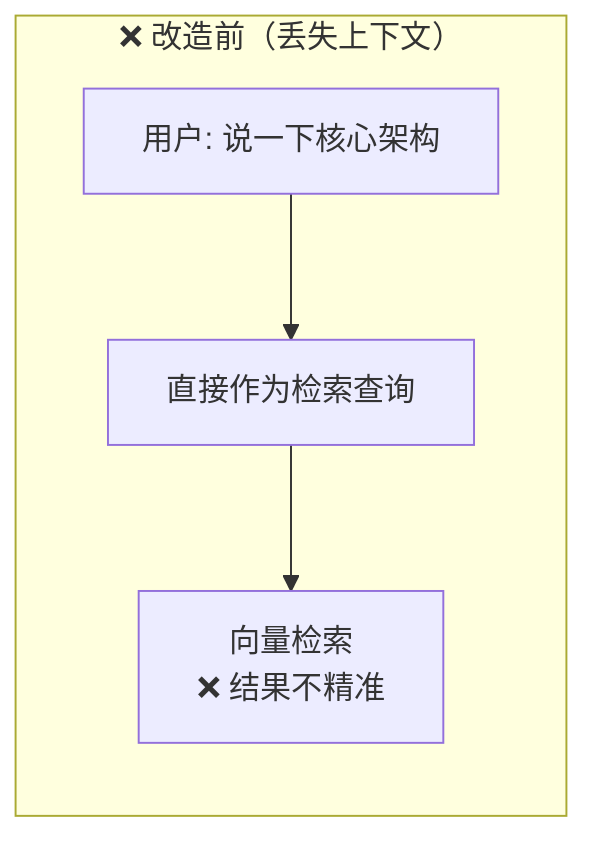
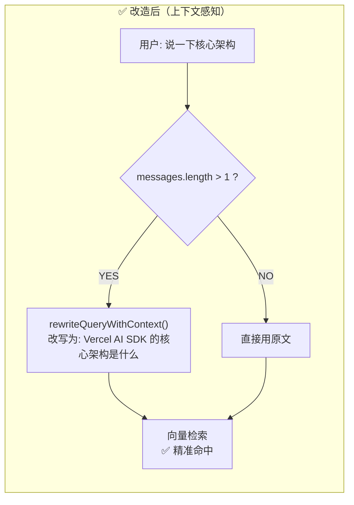
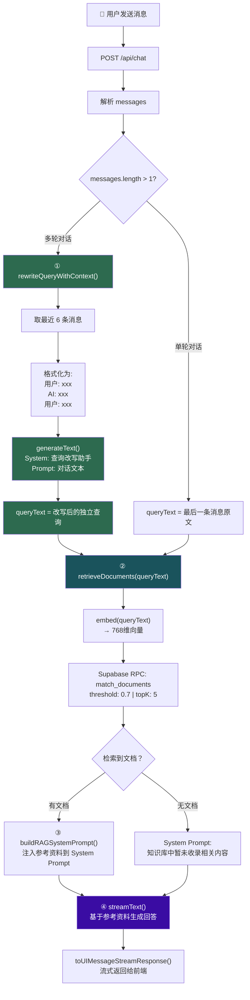
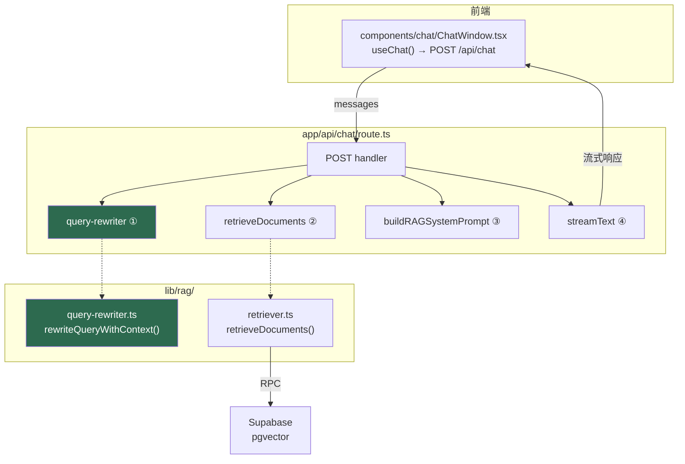
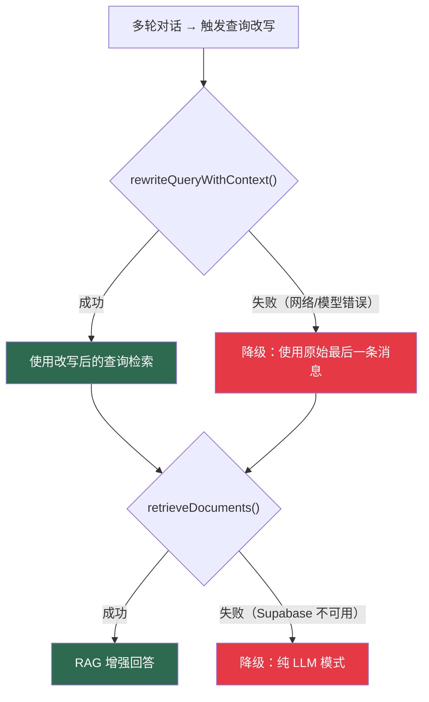

# 多轮上下文检索（Context-Aware Retrieval）

> Week 9 · 进阶检索技巧 · 技巧 1

## 一、解决了什么问题？

在多轮对话中，用户经常使用**代词指代**，导致单独拿最后一句话去向量检索时丢失上下文：

```
用户: "Vercel AI SDK 有哪些核心 API？"
AI:   "有 streamText、generateObject..."
用户: "说一下核心架构"              ← 什么的核心架构？检索不精准
```

## 二、核心方案：Query Condensation（查询浓缩）

用 LLM 将多轮对话浓缩为一个**独立的、完整的**检索查询：

```
"说一下核心架构"  →  LLM 改写  →  "Vercel AI SDK 的核心架构是什么"
```

## 三、完整流程图

### 改造前 vs 改造后





### 完整 RAG Pipeline（含 Query Rewriting）



## 四、代码架构

### 文件关系



### 核心代码

#### `lib/rag/query-rewriter.ts`（新建）

```typescript
export async function rewriteQueryWithContext(
  messages: UIMessage[],
  model: LanguageModel
): Promise<string>
```

| 步骤 | 代码 | 说明 |
|------|------|------|
| 取最近对话 | `messages.slice(-6)` | 最多 3 轮对话，避免上下文太长 |
| 提取纯文本 | `parts.filter(p => p.type === 'text')` | 兼容 UIMessage 的 parts 结构 |
| 格式化 | `"用户: xxx\nAI: xxx"` | 让 LLM 理解对话角色 |
| LLM 改写 | `generateText({ system, prompt })` | 一次性生成，非流式 |

#### `app/api/chat/route.ts`（改造）

```typescript
// 核心改动：在检索前增加查询改写步骤
let queryText = lastMessageText

if (messages.length > 1) {
  try {
    queryText = await rewriteQueryWithContext(messages, model)
    console.log(`[RAG] 原始查询: "${lastMessageText}"`)
    console.log(`[RAG] 改写查询: "${queryText}"`)
  } catch (rewriteError) {
    // 改写失败 → 降级为原始查询（不影响核心功能）
    console.warn('[RAG] 查询改写失败，使用原始查询:', rewriteError)
  }
}
```

## 五、降级策略



> **设计原则：每一步都有降级兜底**。查询改写失败 → 用原始查询。RAG 检索失败 → 纯 LLM 模式。确保聊天功能永远可用。

## 六、实测效果

```
第 1 条: "Vercel AI SDK 有哪些核心 API？"
第 2 条: "说一下核心架构"

终端日志：
[RAG] 原始查询: "说一下核心架构"
[RAG] 改写查询: "Vercel AI SDK 的核心架构是什么"
[RAG] 检索到 5 条相关文档
  [1] 相似度: 90.7% | 来源: docs/streamdown-analysis.md | 核心架构：三位一体
  [2] 相似度: 84.4% | 来源: docs/streamdown-analysis.md | 深度解析与实战指南
  ...
```

改写后的查询精准命中 **"核心架构：三位一体"** 章节，相似度从模糊匹配提升到 **90.7%** ✅

## 七、性能考量

| 指标 | 影响 | 评估 |
|------|------|------|
| **额外延迟** | 多一次 LLM 调用（`generateText`） | 约 0.5-1.5s |
| **额外成本** | Prompt 很短（6 条消息摘要），Token 消耗极低 | 可忽略 |
| **触发条件** | 仅 `messages.length > 1` 时触发 | 首次提问无额外开销 |

> **结论**：以约 1s 的额外延迟换取显著的检索精准度提升，在 RAG 场景下是值得的。
